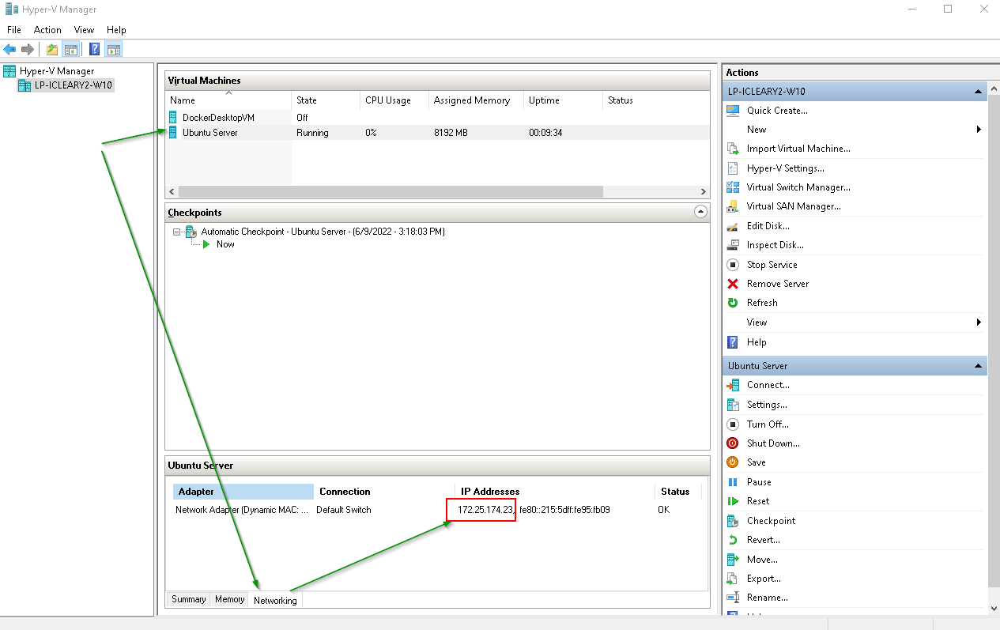

# local-ssh-config

[](https://pycqa.github.io/isort/)
[](https://black.readthedocs.io/en/stable/)
[](https://github.com/pre-commit/pre-commit)
[](https://github.com/iancleary/local-ssh-config/actions/workflows/ci.yml)

Ian Cleary ([iancleary](https://github.com/iancleary))

## Description

**Welcome!** This is a CLI to generate/update SSH config files for your local virtual machines quickly.

## Problem

Windows doesn't maintain a static IP Address of Hyper-V Virtual Machines across reboots.  When using [multipass](https://multipass.run) with a Hyper-V backend, this applies as well for multipass.

This leads to ssh configuration, which is by ip address, to be stale every reboot.

## Solution

This script updates myt ssh config file for me

- get IP address from PowerShell for hyper-v by name according to source ('hyper-v' directly, or 'multipass list')
- write template config files to the `~/.ssh/config.d/` directory according to your `~/.config/local-ssh-config/settings.json` file.

This assumes you have:

- a `~/.ssh/config.d/` folder
- [`Include config.d/*` in your `~/.ssh/config`](https://superuser.com/questions/247564/is-there-a-way-for-one-ssh-config-file-to-include-another-one)
- For Hyper-V Virtual Machines
  - PowerShell installed
  - Hyper-V enabled and The Hyper-V Manager Installed

### Hyper-V Manager IP Address



> I currently use Ubuntu Servers, if you do too, [please install several `apt` packages in the Virtual Machine (so that Hyper-V can report the IP Address)](https://stackoverflow.com/a/72534742/13577666)

🚨🚨 Hyper-V will not report the ip address until you do the above 🚨🚨

> Multipass or Virtual Box may report the IP address of an Ubuntu Guest. I'm not currently sure if it's a Hyper-V limitation or a Windows limitation.  

As this tool only currently supports Hyper-V, please consider this a warning of the required step.

## Quickstart

```sh
❯ pipx install local-ssh-config
❯ local-ssh-config --help
```

That will output the following:

```bash
Usage: local_ssh_config [OPTIONS]

  Creates an `~/.ssh/config.d/` directory, 
  checks to see if you include all files in that directory,
  and then creates config files for each virtual machine specified
  in your `~/.config/vm-ip-ssh-config/settings.json` file.

  See https://github.com/iancleary/local-ssh-config/ for more information.

Arguments:
  None

Options:
  -f, --file TEXT       The JSON file containing the virtual machine
                        configuration  [default: C:\Users\username\.config\vm-
                        ip-ssh-config\settings.json]
  -v, --version         Show the application's version and exit.
  --install-completion  Install completion for the current shell.
  --show-completion     Show completion for the current shell, to copy it or
                        customize the installation.
  --help                Show this message and exit.
```

## Example Usage

The first and only argument is the name of the component to create.

```bash
$ local-ssh-config
{'host': 'test.local', 'hostname': '0.0.0.0', 'user': 'test', 'identity_file': '~/.ssh/example_id_ed25519'}
{'host': 'ubuntu.local', 'hostname': {'source': 'hyper-v', 'physical_address': '00-15-5d-95-fb-09'}, 'user': 'icleary', 'identity_file': '~/.ssh/github_id_rsa_ed25519'}
Hyper-V: Powershell (arp -a): Interface command executed successfully!
-------------------------
{'host': 'dev1.multipass.local', 'hostname': {'source': 'multipass', 'name': 'dev1'}, 'user': 'ubuntu'}
Multipass-V: Powershell (multipass list): Interface command executed successfully!
-------------------------

✨ Creating ~/.ssh/config.d/ files
✅ C:\Users\icleary\.ssh\config.d\test.local
✅ C:\Users\icleary\.ssh\config.d\ubuntu.local
✅ C:\Users\icleary\.ssh\config.d\dev1.multipass.local
SSH config updated! 🚀 ✨!

Thank you for using local-ssh-config.
```

The path printed is the absolute path to the updated config files.

> This uses a directory `~/.ssh/config.d/` to allow for a single file per Host, to allow cleaner version tracking within a dotfile manager.
> See [`Include config.d/*` in your `~/.ssh/config`](https://superuser.com/questions/247564/is-there-a-way-for-one-ssh-config-file-to-include-another-one) for the include syntax
> [WINDOWS_MULTIPASS_DEFAULT_ID_RSA](https://github.com/canonical/multipass/issues/913#issuecomment-697235248) = "C:/Windows/System32/config/systemprofile/AppData/Roaming/multipassd/ssh-keys/id_rsa"

## Configuration

Configuration can be done through 2 different ways:

- Creating a global `settings.json` in your home directory (`~/.config/local-ssh-config/settings.json`).
- Creating a local `.local-ssh-config-config.json` in your project's root directory and including the path to that file with the `--f` or `-f` optionanl command-line argument.

The optional command line value takes precendence global settings file being the default.

## API Reference

### File

Controls the settings.json to load.
Defaults to `~/.config/local-ssh-config/settings.json`

Usage:

Command line: `--file <value>` or `-f <value>`

JSON config:

Example with single host, as dictionary

```json
{
    "host": "ubuntu.local",
    "hostname": {
        "source": "hyper-v",
        "physical_address": "00-15-5d-95-fb-09"
    },
    "user": "icleary",
    "identity_file": "~/.ssh/github_id_rsa_ed25519"
}
```

Example with single host, as list:

```json
[
  {
      "host": "ubuntu.local",
      "hostname": {
          "source": "hyper-v",
          "physical_address": "00-15-5d-95-fb-09"
      },
      "user": "icleary",
      "identity_file": "~/.ssh/github_id_rsa_ed25519"
  }
]
```

> A single dictionary is converted to a list of hosts before looping through the files, so either structure is valid (your preference).

Example with multiple hosts:

```json
[
    {
        "host": "test.local",
        "hostname": "0.0.0.0",
        "user": "test",
        "identity_file": "~/.ssh/example_id_ed25519"
    },
    {
        "host": "ubuntu.local",
        "hostname": {
            "source": "hyper-v",
            "physical_address": "00-15-5d-95-fb-09"
        },
        "user": "icleary",
        "identity_file": "~/.ssh/github_id_rsa_ed25519"
    },
    {
        "host": "dev1.multipass.local",
        "hostname": {
            "source": "multipass",
            "name": "dev1"
        },
        "user": "ubuntu"
    }
]
```

## Further information

> I will likely evolve this CLI as I learn more; I'm on my way 😊

**Enjoy quickly updating your ssh configurations 🚀!**

## Contributing

I created this CLI for my opinionated uses and may not accept changes.  That said, I made this to solve a problem, and if you have the same problem, I hope it helps you! 😊

See [CONTRIBUTING.md](.github/CONTRIBUTING.md).
